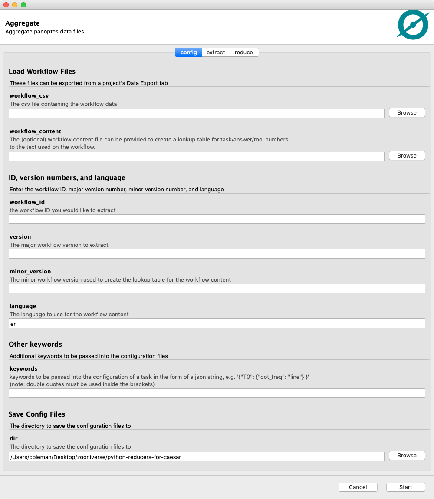
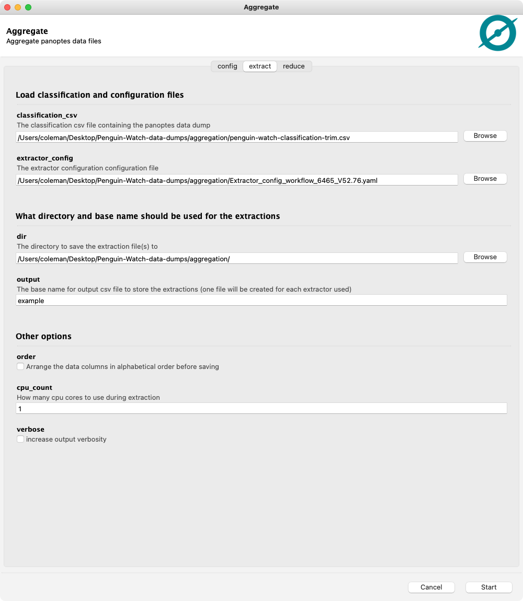
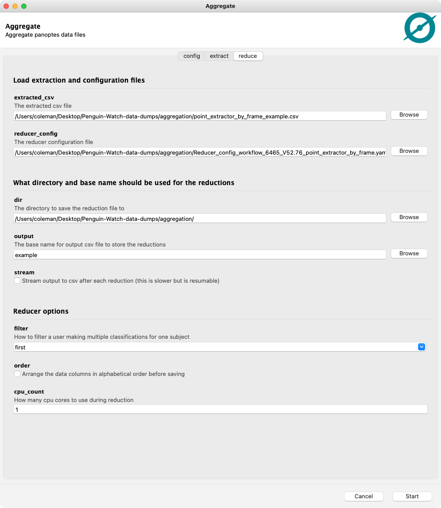
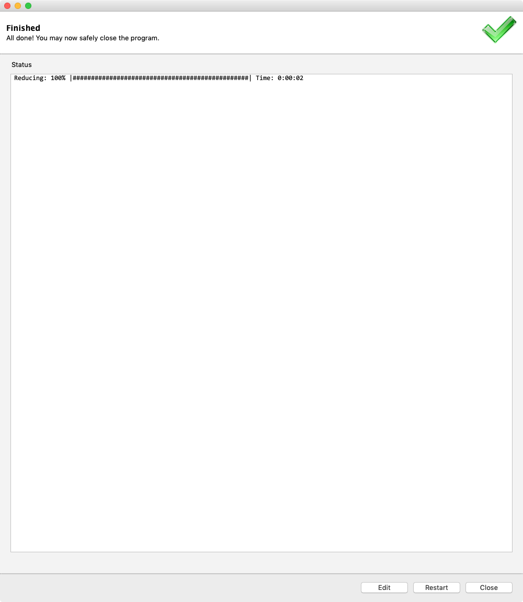

# Using the Graphical User Interface (GUI)
If the GUI component is installed on your computer you can use the GUI instead of the command line to aggregate your Panoptes data.

## Download your data from the project builder
You will need two to three files from your project for offline use:
 - The classification dump: The `Request new classification export` or `Request new workflow classification export` button from the lab's `Data Export` tab
 - The workflow dump: The `Request new workflow export` button from the lab's `Data Export` tab
 - The workflow contents (optional): The `Request new workflow contents export` button from the lab's `Data Export` tab.  This file is used to make a look up table between the column names used for each task/answer/tool and the original text used for them on the project.

### Example: Penguin Watch
Penguin Watch has several workflows, for this example we will look at workflow number 6465 (time lapse cameras) and version `52.76`.  The downloaded files for this project are:
 - `penguin-watch-workflows.csv`: the workflow file (contains the major version number as a column)
 - `penguin-watch-workflow_contents.csv`: the workflow contents file (contains the minor version number as a column)
 - `time-lapse-cameras-classifications-trim.csv`: the classification file for workflow 6465

This [zip folder](https://drive.google.com/file/d/177uXdt3IRIOc2b42UvG4EdNJv973RCtS/view?usp=sharing) contains these files.

## Launching the GUI
Open a terminal and type:
```bash
panoptes_aggregation_gui
```



There are three tabs at the top of the GUI for switching between `config`, `extract`, and `reduce`.

## Configure the extractors and reducers
The `config` tab is used to make configuration `yaml` files that are used to set up the extractors and reducers. These base files will use the default settings for various task types. They can be adjusted if the defaults are not needed (e.g. you don't need to extract all the tasks, or you need more control over the reducer's settings).

### Example: Penguin Watch
We want to configure files for workflow 6465 v52.76.  Enter this information into the GUI and click the `start` button:


We can see this created four `yaml` files in our chosen output directory:
 - `Extractor_config_workflow_6465_V52.yaml`: The configuration for the extractor code
 - `Reducer_config_workflow_6465_V52_point_extractor_by_frame.yaml`: The configuration for the reducer used for the point task
 - `Reducer_config_workflow_6465_V52_question_extractor.yaml`: The configuration for the reducer used for the question task
 - `Task_labels_workflow_6465_V52.76.yaml`: A lookup table to translate the column names used in the extractor/reducer output files into the text originally used on the workflow.

Click the `Edit` button to go back to the previous screen.

---

## Extracting data
Note: this only works for some task types, see the [documentation](https://aggregation-caesar.zooniverse.org/docs) for a full list of supported task types.

The `extract` tab will extract your data into one flat `csv` file for each task type.

### Example: Penguin Watch
Before starting let's take a closer look at the extractor configuration file `Extractor_config_workflow_6465_V52.yaml`:
```yaml
extractor_config:
    point_extractor_by_frame:
    -   details:
            T0_tool3:
            - question_extractor
        task: T0
        tools:
        - 0
        - 1
        - 2
        - 3
    question_extractor:
    -   task: T6
    -   task: T1
workflow_id: 6465
workflow_version: '52.76'
```
This shows the basic setup for what extractor will be used for each task.  From this configuration we can see that the point extractor will be used for each of the tools in task `T0`, `tool3` of that task will have the question extractor run on its sub-task, and a question extractor will be used for tasks `T1` and `T6`.  If any of these extractions are not desired they can be deleted from this file before running the extractor.  In this case task `T4` was on the original workflow but was never used on the final project, I have already removed it from the configuration above.

Note: If a workflow contains any task types that don't have extractors or reducers they will not show up in this config file.

This extractor configuration file can be used along with the classification data to make the extracted `csv` files:




This creates two `csv` files (one for each extractor listed in the config file):
 - `question_extractor_example.csv`
 - `point_extractor_by_frame_example.csv`

Click the `Edit` button to go back to the previous screen.

---

## Reducing data
Note: this only works for some task types, see the [documentation](https://aggregation-caesar.zooniverse.org/docs) for a full list of supported task types.

The `reduce` tab will reduce the extracts by `subject_id` into a consensus aggregation.

### Example: Penguin Watch
For this example we will do the point clustering for the task `T0`.  Let's take a look at the default config file for that reducer `Reducer_config_workflow_6465_V52_point_extractor_by_frame.yaml`:
```yaml
reducer_config:
    point_reducer_dbscan:
        details:
            T0_tool3:
            - question_reducer
```

As we can see, the default reducer is `point_reducer_dbscan` and the only keyword specified is the only associated with the sub-task of `tool3`.  To get better results we will add some clustering keywords to the configuration of `DBSCAN`:
```yaml
reducer_config:
    point_reducer_dbscan:
        eps: 5
        min_samples: 3
        details:
            T0_tool3:
            - question_reducer
```

But for this project there is a large amount of depth-of-field in the images, leading to a non-constant density of point clusters across the images (more dense in the background of the image and less dense in the foreground).  This means that `HDBSCAN` will work better:
```yaml
reducer_config:
    point_reducer_hdbscan:
        min_cluster_size: 4
        min_samples: 3
        details:
            T0_tool3:
            - question_reducer
```

Point the GUI to the extraction file and the configuration file to reduce the data:





This will create one file:
 - `point_reducer_hdbscan_example.csv`: The clustered data points for task `T0`

---

## Reading csv files in python
The resulting csv files typically contain arrays as values.  These arrays are read in as strings by most csv readers.  To make it easier to read these files in a "science ready" way a utility function for `pandas.read_csv` is provided in `panoptes_aggregation.csv_utils`:
```python
import pandas
from panoptes_aggregation.csv_utils import unjson_dataframe

# the `data.*` columns are read in as strings instead of arrays
data = pandas.read_csv('point_reducer_hdbscan_example.csv')

# use unjson_dataframe to convert them to lists
# all values are updated in place leaving null values untouched
unjson_dataframe(data)
```
